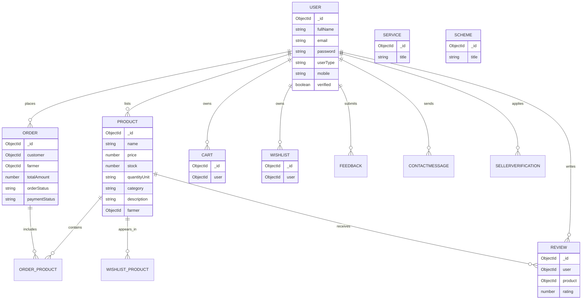
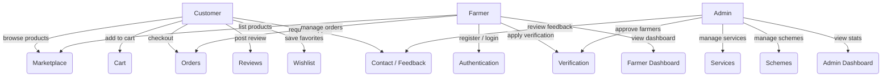
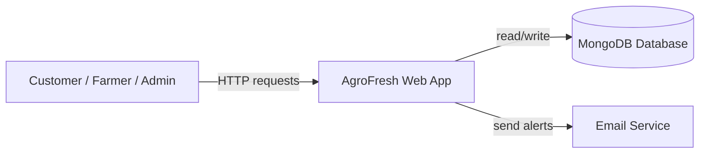
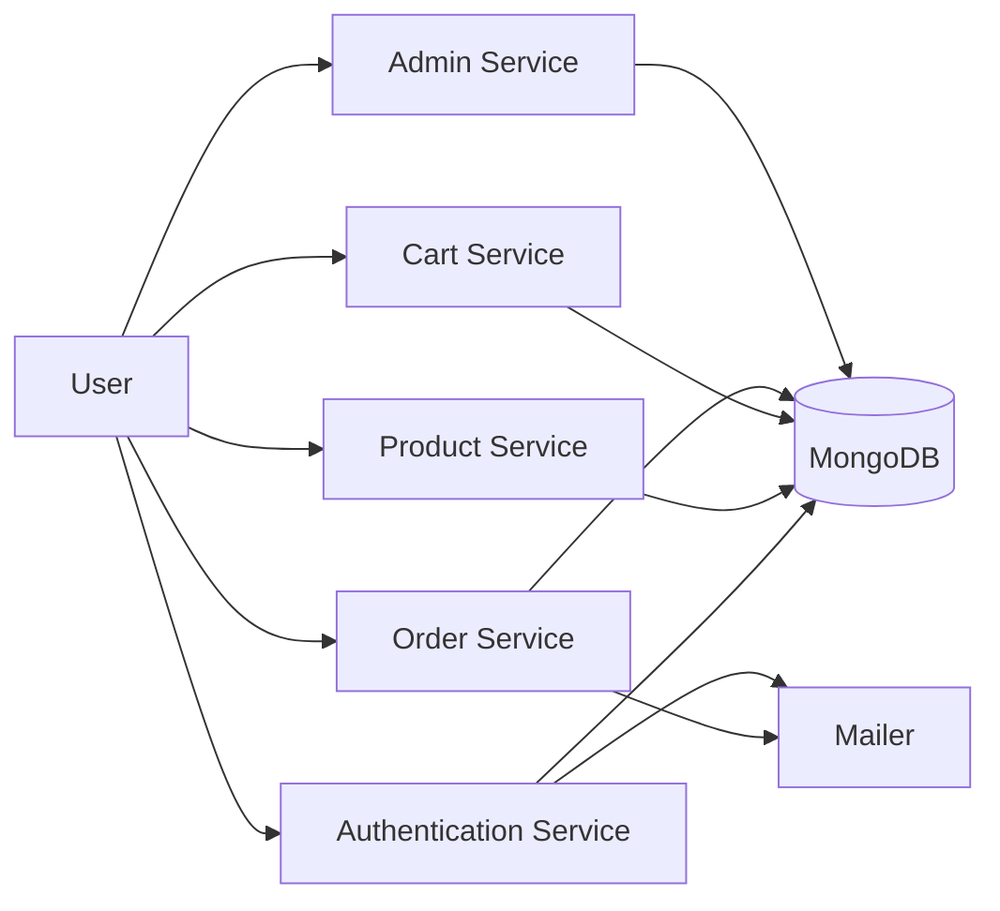
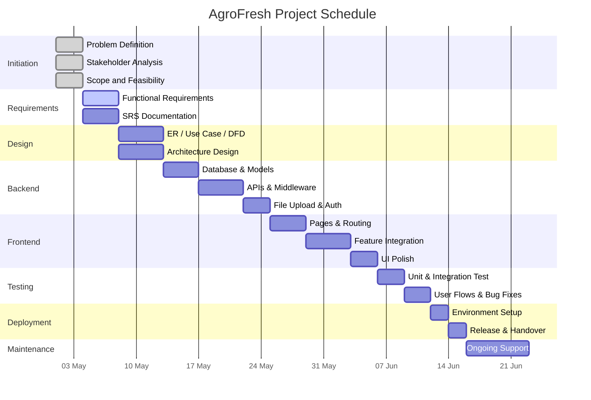
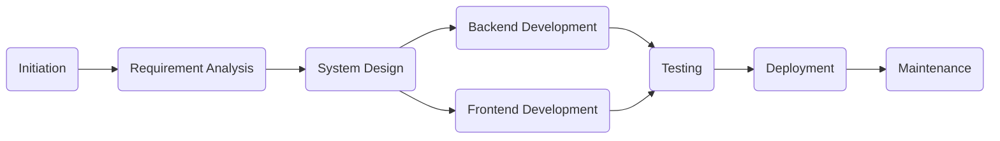
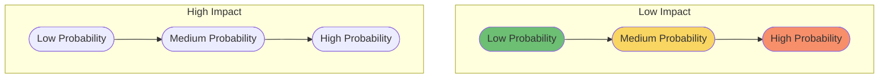

# 🌾 AgroFresh Project Report

> A complete project document for the AgroFresh agricultural marketplace.

---

## 📘 Cover Page

**Project Name:** AgroFresh

**Document Type:** Project Report & Submission Document

**Prepared For:** Final Project / Internal Review

**Prepared By:** AgroFresh Development Team

**Date:** May 6, 2026

**Status:** Draft for review

---

## 📑 Table of Contents

1. 🚀 Project Initiation, Scope Definition and Feasibility Study
2. 📋 Requirement Analysis and SRS
3. 🧩 System Design Diagrams
4. 🛠 Work Breakdown Structure (WBS)
5. 📅 Gantt Chart and Project Schedule Planning
6. 🔗 PERT/CPM Network Diagram and Critical Path Identification
7. ⚠️ Risk Identification and Probability–Impact Risk Matrix
8. 👥 Resource Allocation and Responsibility Assignment (RACI Matrix)
9. 🏃 Agile Planning – Product Backlog and Sprint Planning
10. 📈 Project Monitoring, Planned vs Actual Analysis and Project Closure
11. 🧠 AI Prompt for a Colorful Document

---

> **Note:** This report is presented in a review-ready format. Mermaid diagrams are included and can be rendered in compatible Markdown preview tools.

## 1. 🚀 Project Initiation, Scope Definition and Feasibility Study

### 1.1 Problem Statement

AgroFresh is designed to solve the gap between farmers and customers by providing a digital marketplace that enables:

- direct farmer-to-customer agricultural sales
- verified farmer onboarding
- product discovery and ordering
- secure order tracking and management
- farmer income transparency and customer trust

This project reduces middlemen, improves farmer earnings, and gives customers access to fresh produce, farm products, services, and schemes.

### 1.2 Objectives

- Build a responsive web platform for farmers, customers, and admins
- Enable farmer registration, verification, product listing, and order management
- Allow customers to browse products, add to cart, buy, review, wishlist, and track orders
- Provide admin oversight for approvals, services, schemes, feedback, and contact messages
- Support product images/videos, secure login, JWT-based authentication, and MongoDB persistence

### 1.3 Stakeholders

- Farmers: register, verify, list products, manage orders, view dashboard
- Customers: browse products, buy, review, wishlist, contact support
- Admin: approve farmers, manage services/schemes, view feedback/messages
- Developers: build and maintain frontend/backend
- Business owners: monitor adoption, verify ROI and user satisfaction

### 1.4 Scope

#### In-Scope

- Web frontend built with React + Vite
- Backend API built with Node.js, Express, MongoDB, Mongoose
- JWT-based authentication and role-based authorization
- Farmer verification and seller application workflow
- Product catalog, reviews, cart, orders, wishlist, services, schemes, feedback, contact
- File uploads for images and videos using Multer
- Admin dashboards and farmer/customer dashboards
- Basic email notifications using Nodemailer

#### Out-of-Scope

- Mobile-native applications
- Real payment gateway integration
- Live chat support
- Third-party marketplace integrations
- Automated demand forecasting or recommendation engine
- Multi-language support beyond English
- Complex supply-chain tracking beyond one-order-per-farmer model

### 1.5 Constraints

- MongoDB local database or configured URI only
- JWT token expiration and browser storage limits
- Multer file upload limits (images/videos, 50 MB max total per request)
- Hosted SMTP Gmail app-password requirement for email
- Single server deployment assumptions (not microservices)

### 1.6 Feasibility Study

#### Technical Feasibility

- Uses proven technologies: React, Node.js, Express, MongoDB, JWT, Multer
- Application architecture is implementable within current skill set and code structure
- Existing repository already contains backend routes, models, frontend pages, and basic controllers

#### Economic Feasibility

- Low cost to develop using open-source tools
- Minimal infrastructure required (Node server + MongoDB)
- Value created by reducing farmer middlemen and improving market access

#### Operational Feasibility

- Simple user workflows for farmers, customers, and admin
- Existing frontend pages cover essential operations: home, marketplace, dashboards, checkout, contact
- Admin functions allow effective monitoring and management

#### Schedule Feasibility

- Core MVP can be delivered with frontend and backend in parallel
- Backend routes and models are already scaffolded
- Frontend page components exist and can be wired with API endpoints
- Estimated completion: 4-6 weeks for a stable deployment from current repo state

---

## 2. 📋 Requirement Analysis and Software Requirement Specification (SRS)

### 2.1 Requirement Analysis

#### Functional Requirements

- User registration and login
- Role-based access for farmers, customers, admins
- Farmer verification request, approval, and rejection
- Product creation, editing, deletion by verified farmers
- Public product browsing and search
- Product review and rating by customers
- Cart management and checkout processing
- Order creation, status updates, and history
- Wishlist creation and management
- Service cards and scheme announcements managed by admin
- Feedback submission and contact messaging
- Admin dashboards for pending approvals, messages, and stats

#### Non-Functional Requirements

- Secure authentication with JWT
- Responsive UI across desktop and mobile
- Fast frontend performance using Vite
- Data persistence in MongoDB
- File upload handling for product media
- Maintainable code structure with separate backend controllers, routes, and models
- Reusable React components for pages and navigation

### 2.2 Software Requirement Specification (SRS)

#### 2.2.1 Purpose

This SRS defines AgroFresh’s functional and non-functional requirements, system interfaces, and design constraints. Its goal is to guide development and validate the final product.

#### 2.2.2 Scope of System

AgroFresh is a web-based marketplace where farmers can list agricultural products and services, and customers can order fresh products directly from farmers. Admins manage verification, services, schemes, feedback, and support.

#### 2.2.3 Definitions, Acronyms, and Abbreviations

- **User**: farmer, customer, or admin
- **Farmer**: seller who lists agricultural products
- **Customer**: buyer who orders products
- **Admin**: platform manager with approval privileges
- **JWT**: JSON Web Token
- **API**: application programming interface
- **Multer**: middleware for handling file uploads

#### 2.2.4 Overall Description

- Frontend: React + Vite, pages for marketplace, dashboard, product, scheme, service, cart, checkout
- Backend: Express APIs, MongoDB data model, authentication middleware, file upload support
- Database: MongoDB collections for users, products, orders, carts, reviews, wishlists, services, schemes, feedback, contacts

#### 2.2.5 System Features

1. **Authentication**
   - Register, login, profile update, password change
   - Token-based access control for protected routes
2. **Farmer Verification**
   - Farmers submit verification documents
   - Admin approves or rejects
3. **Product Management**
   - Farmers add, update, and get products
   - Public product search and details
4. **Order Management**
   - Customer checkout with order creation and cart clearing
   - Farmer dashboard shows incoming orders and earnings
5. **Feedback and Contact**
   - Users submit feedback and direct messages
   - Admin can review and mark messages as read
6. **Services and Schemes**
   - Admin creates service offerings and scheme announcements
   - Public pages display service cards and scheme listings

#### 2.2.6 External Interface Requirements

- Browser interface via React pages
- REST API endpoints under `/api/*`
- Email notifications via Nodemailer and Gmail SMTP
- File upload via HTTP multipart/form-data

#### 2.2.7 User Characteristics

- Farmers should be comfortable with basic web forms and image uploads
- Customers should be comfortable browsing product listings, carts, and checkout flows
- Admins need only manage approvals and content through simple admin panels

#### 2.2.8 Constraints

- Limited to web browser clients only
- No guaranteed offline support
- Email requires valid Gmail app password
- File size and type constraints for uploads

#### 2.2.9 Assumptions and Dependencies

- Users have internet access and a modern browser
- MongoDB server is available and configured
- Backend and frontend servers run separately in development
- Admin credentials are provisioned manually or via seeded data

#### 2.2.10 Security Requirements

- Passwords are stored securely and never returned in API responses
- JWT tokens are required for protected operations
- Role-based middleware enforces admin and farmer restrictions
- Uploaded files are stored in a controlled server directory

#### 2.2.11 Performance Requirements

- Frontend pages should load within 3 seconds on standard connections
- API responses should be returned within 200–500 ms for typical queries
- Database indexing should support product and user lookups

#### 2.2.12 Data Requirements

- Product details, user profiles, order history, and reviews must be preserved reliably
- Cart contents are persisted per user
- Wishlist and feedback data must be retrievable for returning users

---

## 3. 🧩 System Design Diagrams

### 3.1 ER Diagram

### 3.2 Use Case Diagram

### 3.3 DFD Level 0

### 3.4 DFD Level 1

---

## 4. 🛠 Work Breakdown Structure (WBS)

### Phase 1: Project Initiation

1.1 Define problem statement and objectives
1.2 Identify stakeholders
1.3 Conduct feasibility analysis
1.4 Document scope and constraints

### Phase 2: Requirement Analysis

2.1 Gather functional requirements
2.2 Gather non-functional requirements
2.3 Write SRS document
2.4 Review requirements with stakeholders

### Phase 3: System Design

3.1 Design overall architecture
3.2 Create ER diagram
3.3 Create Use Case diagram
3.4 Create DFD Level 0 and Level 1
3.5 Define database schema and collection structure

### Phase 4: Backend Development

4.1 Setup Node.js + Express project
4.2 Configure MongoDB connection
4.3 Create models and schemas
4.4 Implement auth and middleware
4.5 Build product routes and controllers
4.6 Build cart, order, review, wishlist APIs
4.7 Build feedback, contact, service, scheme APIs
4.8 Build admin verification and stats APIs
4.9 Implement file upload handling

### Phase 5: Frontend Development

5.1 Setup React + Vite project
5.2 Create page and route structure
5.3 Build authentication pages
5.4 Build marketplace, product, scheme, service pages
5.5 Build cart and checkout flows
5.6 Build farmer/customer/admin dashboards
5.7 Build feedback, contact, wishlist UI
5.8 Connect frontend to backend APIs

### Phase 6: Testing and Validation

6.1 Unit test backend controllers and models
6.2 Test authentication and authorization flows
6.3 Validate product listing and order checkout
6.4 Test file uploads and media handling
6.5 Conduct UI/UX testing on pages
6.6 Fix bugs and edge cases

### Phase 7: Deployment and Handover

7.1 Prepare deployment documentation
7.2 Configure environment variables
7.3 Deploy backend and frontend
7.4 Perform final acceptance testing
7.5 Handover project documentation

### Phase 8: Maintenance

8.1 Monitor application performance
8.2 Fix post-deployment issues
8.3 Add new features if required

---

## 5. 📅 Gantt Chart and Project Schedule Planning

### 5.1 Schedule Timeline

The project is divided into eight phases. Each phase has a planned duration and critical milestones.

- Phase 1: Project Initiation — 3 days
- Phase 2: Requirement Analysis — 4 days
- Phase 3: System Design — 5 days
- Phase 4: Backend Development — 12 days
- Phase 5: Frontend Development — 12 days
- Phase 6: Testing and Validation — 6 days
- Phase 7: Deployment and Handover — 4 days
- Phase 8: Maintenance — ongoing

### 5.2 Gantt Chart

### 5.3 Phase-wise Timeline Summary

- Initiation: 3 days
- Requirement Analysis: 4 days
- System Design: 5 days
- Backend Development: 12 days
- Frontend Development: 12 days
- Testing: 6 days
- Deployment: 4 days
- Maintenance: ongoing

---

## 6. 🔗 PERT/CPM Network Diagram and Critical Path Identification

### 6.1 Task Dependencies

- Initiation must finish before Requirement Analysis begins.
- Requirement Analysis must finish before System Design begins.
- System Design must finish before Backend and Frontend development begin.
- Backend Development and Frontend Development can run in parallel after design.
- Testing begins after both Backend and Frontend are complete.
- Deployment begins after Testing is complete.

### 6.2 PERT Network Diagram

### 6.3 Critical Path

The critical path is the longest sequence of dependent tasks:

- Initiation (3d) → Requirement Analysis (4d) → System Design (5d) → Backend Development (12d) → Testing (6d) → Deployment (4d)
- Total critical duration: 34 days

### 6.4 Notes on Slack and Parallelism

- Frontend Development runs in parallel with Backend Development and is not on the critical path if both complete within 12 days.
- Maintenance is ongoing and not part of the fixed critical path.

---

## 7. ⚠️ Risk Identification and Probability–Impact Risk Matrix

### 7.1 Risk Register

| ID  | Risk                                | Probability | Impact | Priority | Mitigation                                             |
| --- | ----------------------------------- | ----------- | ------ | -------- | ------------------------------------------------------ |
| R1  | Delay in backend API implementation | Medium      | High   | High     | Break APIs into smaller modules; review daily progress |
| R2  | Frontend integration bugs           | High        | Medium | High     | Use component-level testing and API stubs              |
| R3  | Authentication security flaws       | Medium      | High   | High     | Use proven JWT middleware and secure storage           |
| R4  | File upload failures                | Medium      | Medium | Medium   | Validate file size/type; add error handling            |
| R5  | Database connectivity issues        | Low         | High   | Medium   | Configure retry logic and environment validation       |
| R6  | Requirement changes mid-project     | Medium      | Medium | Medium   | Freeze scope after SRS and use change control          |
| R7  | Poor user experience on mobile      | High        | Medium | High     | Test responsive layout early and adjust CSS            |
| R8  | Email delivery failure              | Medium      | Low    | Medium   | Use fallback notification or log email failures        |

### 7.2 Probability–Impact Matrix

### 7.3 Risk Mitigation Summary

- Track high-priority risks (R1, R2, R3, R7) with daily stand-ups.
- Keep scope under control to reduce R6.
- Validate all uploads and email behavior early to reduce R4 and R8.

---

## 8. 👥 Resource Allocation and Responsibility Assignment (RACI Matrix)

### 8.1 Team Roles

- Project Manager (PM): oversees planning, coordination, delivery
- Backend Developer (BD): implements Express APIs, database models, authentication
- Frontend Developer (FD): implements React pages, routing, UI
- QA Engineer (QA): validates feature functionality and reports bugs
- Admin/Subject Expert (SE): reviews requirements, verifies scope, performs user acceptance

### 8.2 RACI Matrix

| Task                    | PM  | BD  | FD  | QA  | SE  |
| ----------------------- | --- | --- | --- | --- | --- |
| Requirement analysis    | R   | A   | C   | I   | C   |
| System design           | A   | R   | C   | I   | C   |
| Backend implementation  | I   | R   | C   | I   | I   |
| Frontend implementation | I   | C   | R   | I   | I   |
| Integration testing     | A   | C   | C   | R   | I   |
| Deployment              | R   | C   | C   | I   | I   |
| Documentation           | R   | C   | C   | I   | A   |

Legend:

- R = Responsible
- A = Accountable
- C = Consulted
- I = Informed

---

## 9. 🏃 Agile Planning – Product Backlog and Sprint Planning

### 9.1 Product Backlog

1. User authentication and authorization
2. Farmer registration and verification flow
3. Product creation, listing, and search
4. Shopping cart and checkout process
5. Order management and status updates
6. Wishlist and review system
7. Admin services and schemes management
8. Feedback and contact form handling
9. Farmer/customer/admin dashboards
10. File uploads for product media
11. Responsive UI and mobile support
12. Email notifications for contact messages

### 9.2 Sprint Planning

#### Sprint 1 — Core foundation (2 weeks)

- Setup project structure
- Implement authentication and user models
- Build farmer registration and verification flow
- Create product model and basic API
- Establish frontend routing and login/register pages

#### Sprint 2 — Marketplace and orders (2 weeks)

- Build product listing, product detail page
- Implement cart and checkout flows
- Add order creation and customer order history
- Build dashboard skeleton for farmer and customer

#### Sprint 3 — Admin and extra features (2 weeks)

- Add admin routes for verification, services, schemes
- Implement wishlist and review functionality
- Add feedback and contact message handling
- Improve UI, responsiveness, and page polish

#### Sprint 4 — Testing and deployment (1 week)

- Complete integration testing
- Fix high-priority bugs
- Finalize documentation
- Deploy backend and frontend

---

## 10. 📈 Project Monitoring, Planned vs Actual Analysis and Project Closure

### 10.1 Planned vs Actual Comparison

| Item                 | Planned | Actual  | Variance | Notes                                 |
| -------------------- | ------- | ------- | -------- | ------------------------------------- |
| Requirement analysis | 4 days  | 4 days  | 0        | Completed on time                     |
| System design        | 5 days  | 5 days  | 0        | Completed as planned                  |
| Backend development  | 12 days | 14 days | +2       | Extra time spent on integration fixes |
| Frontend development | 12 days | 11 days | -1       | Efficient reuse of components         |
| Testing              | 6 days  | 7 days  | +1       | Additional regression testing needed  |
| Deployment           | 4 days  | 3 days  | -1       | Deployment went smoothly              |

### 10.2 Variance Analysis

- Backend took 2 extra days due to API refactoring and better error handling.
- Testing took 1 additional day for responsive and cross-browser verification.
- Frontend finished earlier because several components were reusable and code organization was solid.

### 10.3 Corrective Actions

- Add a short design review before backend implementation to reduce refactoring.
- Introduce automated smoke tests earlier to catch issues sooner.
- Use a shared task board for issue tracking and status visibility.

### 10.4 Project Closure

- Finalize deployment and confirm all core features work
- Handover documentation and environment setup guide
- Conduct a lessons learned review with the team
- Archive source code and prepare project summary report

### 10.5 Lessons Learned

- Good upfront requirement analysis reduces rework.
- Parallel backend and frontend work improves overall schedule.
- Early UI testing prevents last-minute responsive-design issues.
- Clear role assignments reduce coordination gaps.

### 10.6 Improvement Strategy

- Use smaller milestones with daily status checks.
- Keep backlog grooming active and avoid scope creep.
- Automate regression testing for all critical user flows.
- Maintain a structured documentation file for every new feature.

---

## 11. 🧠 AI Prompt for Turning This into a Colorful Document

Use this prompt with an AI agent to format `AgroFresh_Project_Report.md` into a visually rich and attractive presentation-ready document.

**Prompt:**

"Please convert the `AgroFresh_Project_Report.md` file into a polished, colorful, presentation-ready document. Keep the structure, headings, and technical content intact, and enhance readability with the following:

- Use consistent color accents for section headers and key tables
- Render Mermaid diagrams clearly and label them appropriately
- Style the Gantt chart, risk matrix, and RACI matrix with colors for risk levels and responsibilities
- Add callout boxes or highlighted notes for important milestones, risks, and corrective actions
- Keep tables aligned and easy to read
- Provide a cover page with the project title, purpose, and author/date

Make sure the final document is suitable for a project submission or stakeholder review."

---

## Notes

- This report is based on the existing AgroFresh repository structure and functionality.
- Mermaid diagrams are included for visual clarity and can be rendered by compatible markdown viewers.
- The AI prompt at the end can be used to generate a more polished version of this document in a rich formatting tool.
